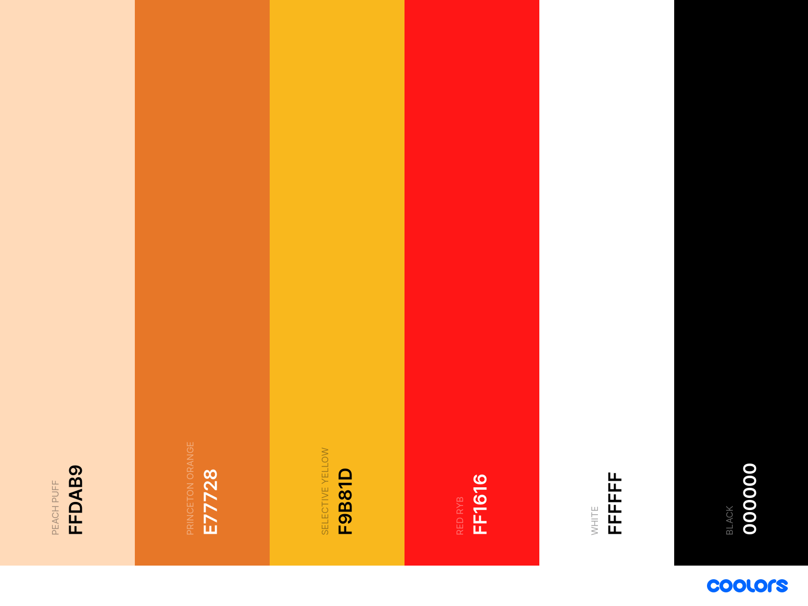
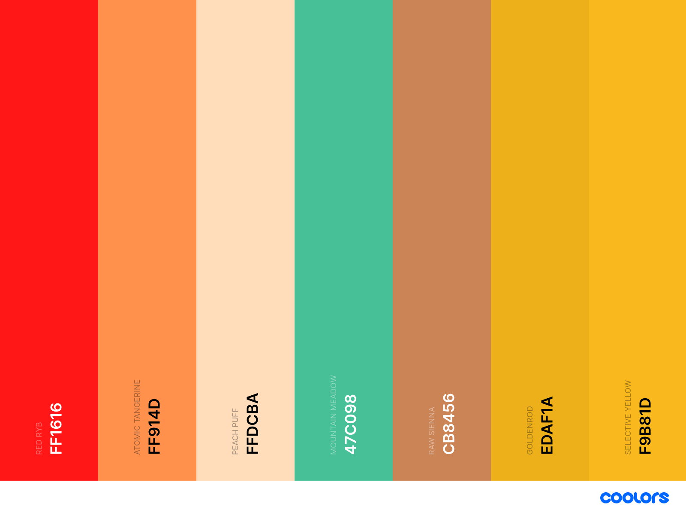

# Love Cebu!

### Thank you for checking my project! And Welcome to Love Cebu! 


After considering my First project, I decided to create Love Cebu!, a travel website, solely focusing on Cebu in the Philippines. 

I chose to create a travel-based website focusing on Cebu, because of the sentimental attachment I have to the island and its reputation as a popular travel destination for both local and international visitors from various regions of Asia, Europe, and Canada to name a few. 

Cebu is the 2nd largest city in the Philippines and is located in the heart of the Philippines, in the Visayas region, and is blessed with lots of natural resources… Not to mention, the beautiful beaches. 

But above all, Cebu is my hometown, and where I grew up before moving overseas. Having this as my first project is an honour and tribute to the island of Cebu.

As we say in the Philippines, **_"Mabuhay!" ("Welcome!")._** 

# Table of Contents:

- [UX](#ux)
  * [Project Goals](#project-goals)
  * [Website Expectations](#website-expectations)
  * [User Requirements](#user-requirements)
  * [Users Expectations](#users-expectations)
  * [User Stories](#user-stories)
- [Wireframes](#wireframes)
- [Features](#features)
  * [Home page](#home-page)
    + [Navbar](#navbar)
    + [Jumbotron](#jumbotron)
    + [A Small Introduction Paragraph](#a-small-introduction-paragraph)
    + [Feature section](#feature-section)
    + [Photographs of Cebu](#photographs-of-cebu)
    + [Footer](#footer)
  * [Experience Cebu page](#experience-cebu-page)
    + [Navbar and Footer](#navbar-and-footer)
    + [Jumbotron](#jumbotron-1)
    + [Article Title](#article-title)
  * [Ready to Visit page](#ready-to-visit-page)
    + [Navbar and Footer](#navbar-and-footer-1)
    + [Jumbotron](#jumbotron-2)
    + [Article Title](#article-title-1)
    + [The page contents](#the-page-contents)
  * [About page](#about-page)
    + [Navbar and Footer](#navbar-and-footer-2)
    + [Jumbotron](#jumbotron-3)
    + [Page content](#page-content)
  * [Contact page](#contact-page)
    + [Navbar and Footer](#navbar-and-footer-3)
- [Color theme](#color-theme)
- [Font](#font)
- [Logo Design theme](#logo-design-theme)
- [Deployment](#deployment)
  * [Cloning Love Cebu from GitHub](#cloning-love-cebu-from-github)
- [Testing](#testing)
  * [Weather widget](#weather-widget)
  * [Embed Google Map](#embed-google-map)
  * [Website responsiveness](#website-responsiveness)
- [Technologies used](#technologies-used)
  * [Languages](#languages)
  * [Tools and Libraries](#tools-and-libraries)
- [Credits](#credits)
  * [Code](#code)
  * [Photos and Videos](#photos-and-videos)
  * [Links](#links)
  * [Acknowledgements](#acknowledgements)
  * [Additional credits](#additional-credits)
  * [Site Disclaimer](#site-disclaimer)

<small><i><a href='http://ecotrust-canada.github.io/markdown-toc/'>Table of contents generated with markdown-toc</a></i></small>

# UX 

## Project Goals

I chose Love Cebu!, as the name of my website and for this project, is because I got the inspiration from Cape Town, South Africa’s travel website called [“Love Capetown,”](https://www.capetown.travel/).

But aside from that, I want people to know that there’s a reason to Love Cebu! Through this website. Furthermore, Love Cebu! wants to: 

* To attract users with the content and look of the entire website.
* To provide information to users and making it interactive.
* To drive attraction and attention to users who are planning to visit the island and are looking for information under one website. 
* To promote the island’s tourism and the reason why Cebu should be their choice of destination.  
* To provide information to users in terms of activities and affordability that suits their needs of Cebu.
* To attract both international and local users to visit Cebu through the information provided on the site. 

## Website Expectations

* Users are able to reach out to us through our Social media pages and leverage them to build a strong website presence to drive users to the site. 
* Users are able to contact us via the contact link provided.
* To attract different type of demographic to the site.
* To give a subliminal message that Cebu is a friendly and fun island to visit as they browse around the site. 
* To give a message that it is personally speaking to the user to invite them to Cebu. 
* To encourage users to use our affiliate links without going through an external site to monetize the site. 

## User Requirements

* The site can be accessed on Desktop, Mobile, and Tablet.
* A contact page to reach out to the site owner.
* Social media pages when they need to alternatively contact site owner outside the Love Cebu! Website.
* The site to be consistently responsive. 


## Users Expectations

* A site that has images and videos of Cebu. 
* A link for when they would like to book travel arrangements to Cebu. 
* A site that has a social media page when they want to interact and engage with the site owner via those channels. 
* That the site is easy to navigate and will provide information that fits what they’re looking for. 
* Advice on how to get to Cebu and the cost of getting there or expenses on activities, food, and drinks. 

## User Stories 

* As a user, I want to search for an alternative travel destination that is warm all year round.
* As a user, I want to find information about the destination all in one site.
* As a user, I want to find activities that are based on my interest. 
* As a user, I want to receive essential information regarding destination and travel booking options.
* As a user, I want to find a destination that fits my budget. 
* As a user, I want a travel website that can respond to any further queries that I may have. 
* As a user, I want to be immersed in the destination as if I am already there.

# Wireframes

My wireframes were all created using [Balsamiq wireframes](https://balsamiq.com/). I’ve individually created wireframes for Desktop, Tablet, and Mobile versions. 

An updated wireframes were also created to match the final layout of the website. 

Reasons why I had to update the wireframes: 
* I removed the weather widget app as it wasn't responsive to how I wanted it positioned when testing it using tablet and mobile.
* Contact forms removed on the Home, Experience Cebu, Ready to Visit and About pages and kept it on the Contact page as it felt redundant. 
* Updated the footer to get the copyright, social media logos and brand logo to be centered. 
* As I had some ideas changed on the Final execution of the website on the Experience Cebu and Ready to Visit page, I wanted my Wireframe to mirror how it should look like to the website I created. 

Both my initial and updated wireframes can be viewed here: [Wireframes](https://github.com/GlobetrotterG/lovecebu/tree/master/wireframes)

# Features

## Home page 

### Navbar
* 5 different page sections were created for users ease of navigating the site. 
* Navbar are subdivided in to Home, Experience Cebu, Ready to Visit?, About, and Contact pages.
* On the left, I placed the Love Cebu! 

### Jumbotron
* A background photo of a colourful festivity called Sinulog was added and taken from photographer Ralph Llanos via the [Cebufinest site](https://cebufinest.com/sinulog-2020-mass-schedules-and-activities/). to add to the ambiance of the page.
* A video of Cebu plays in the background for more visual engagement for the users. This can be controlled by the user.
* A slogan is added with 3 different colors that is relevant to the theme of the page with an opaque background that's the same colour as the body background.

### A Small Introduction Paragraph
* A small introduction with the words "It's More Fun in Cebu!" (Inspired by the famous slogan **_"It's More Fun in the Philippines"_** campaign by the Philippine Department of Tourism) to set the tone.

### Feature section
* Created as a teaser and an option to click the **"Experience Cebu"** or **"Ready to Visit?."**
* The **"Experience Cebu"** photo used is the Kawasan Falls in Badian,Cebu.
* The **"Ready to Visit?"** photo was taken onboard my Philippine Airlines flight in February 2020 with their Inflight Magazine. 

### Photographs of Cebu
* An Instagram logo was added and taken from [freepnglogos](https://www.freepnglogos.com/images/instagram-logo-png-2428.html).
* It has 8 photos of Cebu that are clickable and redirects users to the Instagram page.
* The Instagram logo is also clickable and redirects users to the Instagram page.

### Footer
* Social media icons added (Facebook, Instagram, Pinterest, Twitter and YouTube)
* Small logo of Love Cebu! also added

## Experience Cebu page

### Navbar and Footer
* Similar to Home page

### Jumbotron
* The Section title **"Experience Cebu"** added and background photo similar to home page. Text colour is default to black.
* A YouTube video added with a Sinulog festival theme. This is a Mardi-Gras festivity that happens on the 3rd Sunday of January in honour of the patron Saint of Cebu. The video itself has that upbeat and welcoming theme to invite visitors to Cebu.

### Article Title
* An article title **"Top Ten Things to do When in Cebu"** is added to highlight the highlight of the page.
* The article comes with photos and descriptions.

## Ready to Visit page

### Navbar and Footer
* Similar to Home page

### Jumbotron

* The Section title **"Ready to Visit?"** added and background photo similar to home page. Text colour similar to Experience Cebu page.

### Article Title

* Article title is **"Information and Advice"** in Three colours that matches the ambiance of the sites theme. 
* An interactive Google map image of Cebu is embedded below the article title. The html code was supplied by [Embed Googlemap](https://www.embedgooglemap.net/). As some of the code was inline styled in HTML, I had to transfer them to CSS to be keep it uniformed and consistent.

### The page contents

* The page contains 12 different sections: 
    * Currency
    * Languages Spoken
    * Season
    * Getting Around Cebu
    * The Locals
    * Shopping
    * Phone Network
    * Visa Entry
    * Getting to Cebu
    * Airport
    * Where to stay?
    * Learn Cebuano

## About page

### Navbar and Footer
* Similar to Home page

### Jumbotron

* The Section title **"About Love Cebu"** added and background photo similar to Home page. Text colour similar to Experience Cebu page.

### Page content
 * Has a Intro title **"Who We Are"** and an article about the person behind Love Cebu! site with my photo below the article. 

## Contact page

### Navbar and Footer
* Similar to Home page

# Color theme
* Cebu is a tropical island, and has a very vibrant atmosphere, I came up with some vibrant and Fiesta colours that compliments the logo of Love Cebu! 
* I used the site [Coolors](https://coolors.co/) to get colour inspiration for the site. 
* Colours that were chosen were: 
  * #ffdab9 (Peach Puff) - Used for the body of the site and a highlight to the index.html Jumotron slogan **"Cebu...Queen City of the South."**
  * #e77728 (Princeton Orange) - Used as a background colour for the Navbar, Footer, buttons, and Section separator on pages. It's also been used on some words on the Jumbotron or Intro texts.
  * #f9b81d (Selcetive Yellow) - Used in Contact form, when you over the Nav list, buttons and also used on some words on the Jumbotron slogan.
  * #ff1616 (Red RYB) - Used on some words on every page, except the Contact page. This is to blend with the **"Love"** word on the Love Cebu! logo which is the same colour. 
  * #fff (White) - Used as a text colour for the Nav lists, Social media links on Footer, and on Section separator on the Home page.
  * #000000 (Black) - Used as a default colour text, especially on articles and on the Experience Cebu page. 



# Font 
* Initially, 2 fonts were chosen for the site, which were Merriweather and Lato. But I decided for uniformity, and went for [Merriweather](https://fonts.google.com/specimen/Merriweather), and picked fonts 400, 700 and 900. 

# Logo Design theme
* Love Cebu! theme was chosen with the use of [Canva](https://www.canva.com/).
* Font name: Luckiest Guy 
* I chose the design because of the fun and personal theme it has. A Mango icon was added to the logo, which is a fruit that Cebu is known for.
* These are the colour themes of the logo: 
    * Love - #ff1616 (Red RYB)
    * Cebu! - #ff914d (Atomic Tangerine)
    * Brush stroke background - #ffdcba (Peach Puff)
    * Mango - had default colours of #47c098 (Mountain Meadow), #cb8456(Raw Sienna), #edaf1a(Golden rod), #f9b81d(Selective Yellow).
        *Color names were taken from [Coolors](https://coolors.co/).
* The White background on the logo was removed using [remove.bg](https://www.remove.bg/).


# Deployment

Love Cebu! was developed on GitPod, using git and GitHub to host the repository.

When deploying Love Cebu! using GitHub Pages, the following steps were made: 

* Opened up **GitHub** in the browser.
* Signed in using username and password. 
* Selected my **repositories**.
* Navigated to **'/GlobetrotterG/lovecebu'**.
* In the top navigation clicked **'settings'**.
* Scrolled down to the **GitHub Pages** area.
* Selected **'Master Branch'** from the **'Source'** dropdown menu.
* Clicked to confirm my selection. 
* Love Cebu! is now live on GitHub pages.

## Cloning Love Cebu from GitHub

* Navigate to **'/GlobetrotterG/lovecebu'**.
* Click the green **'Clone or Download'** button.
* Copy the url in the dropdown box. 
* Using your favourite **IDE,** open up your preferred **terminal**. 
* Navigate to your desired file location. 
* Copy the following **code** and input it into your terminal to clone Love Cebu! 

```
git clone: https://github.com/GlobetrotterG/lovecebu.git
```

# Testing

## Weather widget
I initially included a weather widget app to my Navbar, which I got from [hotelmix](https://hotelmix.co.uk/?page=weather_widget_customize&type=30&cityID=19019&cmetric=1&gparams=30#). They provided an embedded HTML code, however it was copyrighted, which meant I couldn't change anything with their code. 
I wrapped it around a Div, and styled it without affecting their code using CSS. It was responsive on a laptop and desktop, but it didn't respond to how I wanted it to look on a mobile and tablet, and I made the decision of removing it instead. 

## Embed Google Map
With the help of a [Google](https://www.google.com/) search, I was able to find an alternative to embedding a Google map using [Embed Google map](https://www.embedgooglemap.net/en/). The embed code was responsive on all devices, and managed to move the inline style codes from HTML to CSS for consistency. 

## Website responsiveness
* Site was coded using a Dell XPS 13 laptop and also used it to test website responsiveness on laptop.
* Mobile site version was tested using an iphone 7 Plus, Samsung Galaxy S10+, Google Pixel 3a XL phones. 
* Tablet site version was tested on an ipad Air.
* To test overall website responsiveness for Laptop, Desktop, Mobile and Tablet, I also used Google Chrome DevTools.
* HTML code was tested using [W3C Markup Validation Service](https://validator.w3.org/)
* CSS code was tested using [W3C CSS Markup Validation Service - Jigsaw](https://jigsaw.w3.org/css-validator/)

# Technologies used

## Languages
* HTML
* CSS

## Tools and Libraries
* [Gitpod](https://gitpod.io/)
* [Bootstrap](https://getbootstrap.com/)
* [Font-awesome](https://fontawesome.com/)
* [Google Fonts](https://fonts.google.com/)
* [Embed Google Map](https://www.embedgooglemap.net/en/)
* [remove.bg](https://www.remove.bg/)
* [Canva](https://www.canva.com/)

# Credits

## Code

* Coding this project was made possible through the Modules learned with the Code Institute.
* Additional, in-depth learning and code knowledge to come up with a responsive site using HTML, CSS, and Bootstrap also came from the following sites: 
    * [W3 Schools](https://www.w3schools.com/)
    * [MD Bootsrap](https://mdbootstrap.com/)
    * [MDN Web Docs](https://developer.mozilla.org/en-US)
    * [CSS Tricks](https://css-tricks.com/)
* When I'm unsure of something, I also look for similar questions on the [Stack Overflow forum](https://stackoverflow.com/)

* External codes were also used for the following: 
    * Embedding a [Google Map](https://www.embedgooglemap.net/)

## Photos and Videos

* Home page video was provided by my brother, James Brian Hutchinson, who created a video on one his travels back home in Cebu. Thank you James! 
* Experience page video was taken from [Queen City Cebu YouTube Channel](https://www.youtube.com/watch?v=ZCkNMYuszz0&t=1s)
* Some photos were taken from the following (May or may have not been included in the Final execution of the site): 
    * [Unsplash](https://unsplash.com/)
    * [Pexels](https://www.pexels.com/)
    * [Pixabay](https://pixabay.com/images/search/cebu/)
    * For the Jumbotron photo, this was taken from [Cebu Finest site](https://cebufinest.com/sinulog-2020-mass-schedules-and-activities/), and photographer is Ralph Llanos.
* Friends that were supportive and provided some of their Cebu photos: 
    * Jeffrey Salas
    * Rowena Matuguina
    * Melojane Alfeche Cabahug
    * Atty. Mark Anthony Gaviola
    * Vhern Igoy
    * Jessa M. Gelbolingo
* Instagram Icon on the Photographs of Cebu section was taken from [freepnglogos](https://www.freepnglogos.com/images/instagram-logo-png-2428.html).

## Links
 * Some of the information that I've used for the articles on this site was taken from [Wikipedia](https://www.wikipedia.org/)
 * Links that are used on this site: 
    * [Philippine Department of Foreign Affairs](https://consular.dfa.gov.ph/services/visa/visa-general-info)
    * [Globe Telecom](https://www.globe.com.ph/)
    * [Smart](https://smart.com.ph/)
    * [Mactan Cebu Airport](https://mactancebuairport.com/)
    * [Philippine Airlines](https://www.philippineairlines.com)
    * [Cebu Pacific](https://www.cebupacificair.com/)
    * [Air Asia](https://www.airasia.com/)
    * [Cathay Pacific](https://www.cathaypacific.com)
    * [Expedia](https://www.expedia.com)
    * [OceanJet](http://www.oceanjet.net)
    * [2Go](https://travel.2go.com.ph)
    * [airbnb](https://www.airbnb.com/)
    * [booking.com](https://www.booking.com/)
    * [Facebook](https://www.facebook.com)
    * [Instagram](https://www.instagram.com)
    * [Pinterest](https://www.pinterest.com)
    * [Twitter](https://www.twitter.com)
    * [Youtube](https://www.pinterest.com)
* For colour themes and identifying colour names, I used: 
    * [coolors](https://coolors.co/)
    * [Color Hexa](https://www.colorhexa.com/)

## Acknowledgements

* I want to thank my amazing mentor, [Simen Daehlin](www.github.com/Eventyret), who motivated and pushed me to create a project that best resonates my passion and what I like. He's been very helpful and have shared his wealth of knowledge that makes me learn more. Thank you Simen!
* I also want to thank the Code Institute community via Slack, as they've been very helpful in answering my questions and also serves as a source of information when I needed answers to help me solve my code. 
* This project is of course dedicated to my hometown Cebu! My love and inspiration for this island is the reason why I created this project! 


## Additional credits

* My website inspiration came from the following sites: 
    * [Love Capetown](https://www.capetown.travel/)
    * [It's More Fun in the Philippines](https://www.itsmorefuninthephilippines.com/)

## Site Disclaimer

* This website and its contents were created for educational purposes.


